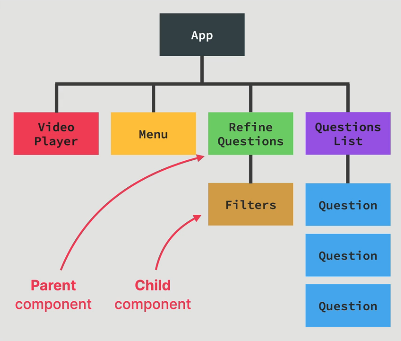

## 35. Components as Building Blocks

#### what are react componenets

- building blocks of user interface
- react render each block to make UI
- componenet has
  - data , logic , and appearance
- nested , resued components
- 
