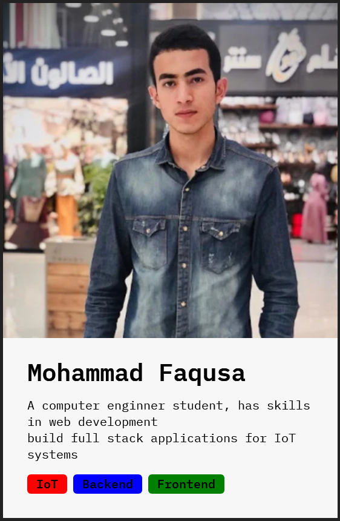

## 44. CHALLENGE #1: Profile Card (v1)

#### here is the link of the [challenge](https://codesandbox.io/p/sandbox/react-challenge-dev-profile-starter-ng0ghj)

```javascript
import { StrictMode } from "react";
import { createRoot } from "react-dom/client";
import "./styles.css";

function App() {
  return (
    <div className="card">
      <Avatar image="https://i1.rgstatic.net/ii/profile.image/1143158268276737-1649561578545_Q512/Mohammad-Faqusa.jpg" />
      <div className="data">
        <Intro />
        <SkillList />
      </div>
    </div>
  );
}

function Avatar(props) {
  return ;
}

function Intro() {
  return (
    <div>
      <h1>Mohammad Faqusa</h1>
      <p>
        A computer enginner student, has skills in web development
        <br /> build full stack applications for IoT systems
      </p>
    </div>
  );
}

function SkillList() {
  return (
    <div className="skill-list">
      <Skill skill="IoT" color="red" />
      <Skill skill="Backend" color="blue" />
      <Skill skill="Frontend" color="green" />
    </div>
  );
}

function Skill(props) {
  return (
    <div className="skill" style={{ backgroundColor: props.color }}>
      {props.skill}
    </div>
  );
}

const rootElement = document.getElementById("root");
const root = createRoot(rootElement);

root.render(
  <StrictMode>
    <App />
  </StrictMode>
);
```

#### The card :


