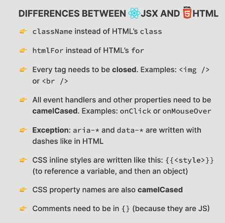

## 45. The Rules of JSX

#### genera jsx rules

- {}
- javaScript expressions inside {},
- statements are not allowed in {}
- jsx produces a javascript expressions

  ```javascript
  const el = <h1>Hello React!</h1>; // we can include {}
  const el = React.createElement("h1", null, "Hello React!");
  ```

- has one root element, if mutli then use React.Fragement
-

#### difference between jsx and html


