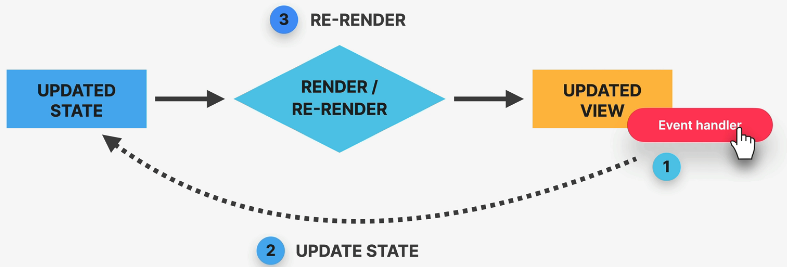

## 62. The Mechanics of State

#### mechanics of state

- we now that react is imarative
- re rendering :
  - call the component function again
  - state are preserved (not reset)

#### when the statee change

